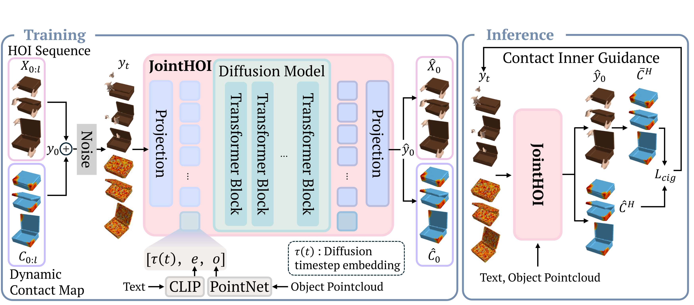

<!-- Using HTML to center the abstract -->
<div class="columns is-centered has-text-centered">
    <div class="column is-four-fifths">
        <h2>Abstract</h2>
        <div class="content has-text-justified">
Text-driven hand--object interaction (HOI) generation is gaining attention for immersive applications and robotics, yet producing physically plausible interactions remains challenging. Even when individual motions appear natural, small contact errors can cause conspicuous artifacts such as floating and interpenetration. Prior methods mitigate these issues using explicit contact cues or implicit grasp priors, but typically rely on multi-stage pipelines and fail to model temporally evolving contact. We present JointHOI, a single-stage diffusion framework that jointly generates 3D hand-object motion and dynamic, distance-based contact maps from text. By treating contact as an auxiliary inner modality, joint generation enables the model to learn contact--motion coupling during training. At inference, contact-guided sampling enforces consistency between generated contact maps and motion-implied geometry, improving temporal stability and reducing penetration and floating.
        </div>
    </div>
</div>

<div class="columns is-centered has-text-centered">
    <div class="column is-four-fifths">
        
        <p><em>JointHOI generates physically grounded bimanual interactions from diverse text prompts.</em></p>
    </div>
</div>

---
## Method

<div class="columns is-centered has-text-centered">
  <div class="column is-four-fifths">

    <div class="content has-text-justified">
      To address the limitations of prior multi-stage or implicit approaches, we propose <b>JointHOI</b>, a framework that treats contact not as a post-processing signal, but as an <i>inner modality</i> of hand–object motion.
    </div>
    
    <div class="columns is-centered has-text-centered">
        <div class="column is-four-fifths">
            
        </div>
    </div>

    <div class="content has-text-justified">
      We jointly model 3D hand–object motion and dynamic, distance-based contact maps within a unified diffusion framework.
    </div>

    <ul>
        <li>
            <b>Joint Generation.</b>
            <br>
            We introduce a single-stage diffusion model that jointly generates 3D hand–object motion together with <b>dynamic, distance-based contact maps</b>.
            By modeling motion and contact within a unified generative process, the model learns explicit <i>contact–motion coupling</i> and captures their spatiotemporal co-evolution.
        </li>

        <li>
            <b>Contact Inner Guidance (CIG).</b>
            <br>
            At inference time, we leverage the generated contact maps as an <i>inner guidance signal</i> to steer the denoising process. 
            CIG enforces consistency between predicted contact and motion-implied geometry, significantly reducing artifacts such as <b>interpenetration</b>, <b>floating</b>, and unstable grasps.
        </li>
    </ul>

    <div class="content has-text-justified">
      This design enables physically plausible and temporally stable hand–object interactions directly from text, without requiring multi-stage pipelines or post-hoc refinement.
    </div>

  </div>
</div>
---

## Experiments

<div class="columns is-centered has-text-centered">
  <div class="column is-four-fifths">

    <b>Quantitative Results</b>
    <br>
    

    <br><br>

    <b>Qualitative Results</b>
    <br>
    

  </div>
</div>

---

## Videos

<div class="columns is-centered has-text-centered">
  <div class="column is-four-fifths">

    <b>Comparison with baselines</b>
    <br>
    <video controls autoplay loop muted playsinline style="width:100%;">
      <source src="static/video/Comparison_with_baselines.mp4" type="video/mp4">
    </video>

    <br><br>

    <b>Additional qualitative results</b>
    <br>
    <video controls autoplay loop muted playsinline style="width:100%;">
      <source src="static/video/Additional_qualitative_result.mp4" type="video/mp4">
    </video>

  </div>
</div>

---

## Citation
```

```
