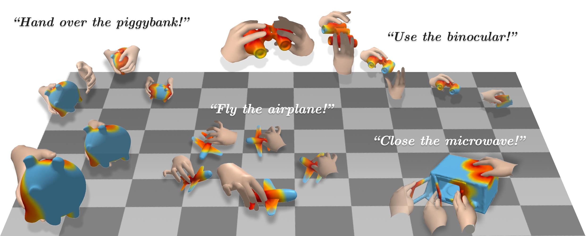
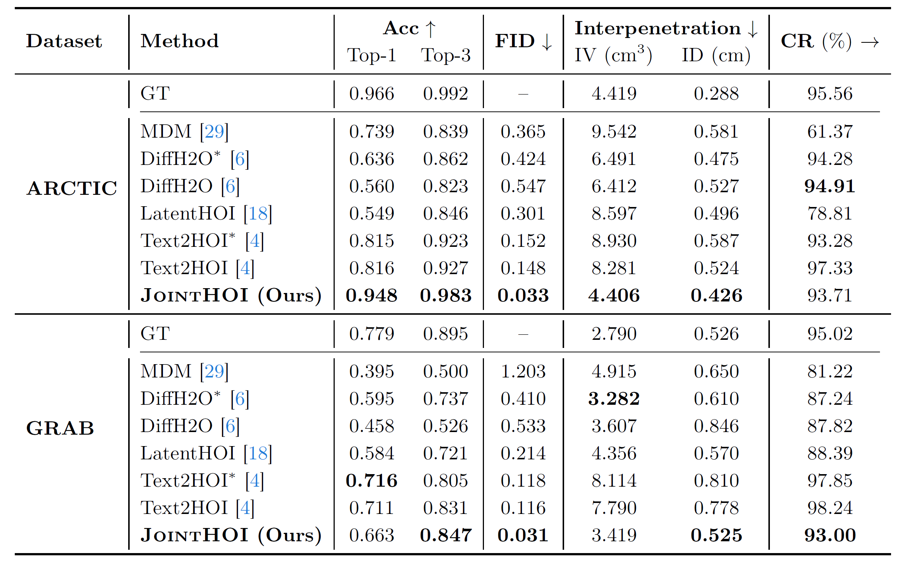
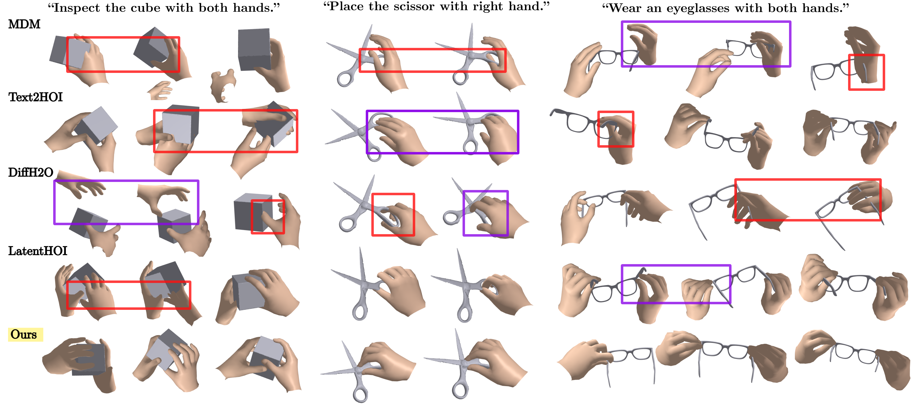

<!-- Using HTML to center the abstract -->
<div class="columns is-centered has-text-centered">
    <div class="column is-four-fifths">
        <h2>Abstract</h2>
        <div class="content has-text-justified">
Text-driven hand--object interaction (HOI) generation is gaining attention for immersive applications and robotics, yet producing physically plausible interactions remains challenging. Even when individual motions appear natural, small contact errors can cause conspicuous artifacts such as floating and interpenetration. Prior methods mitigate these issues using explicit contact cues or implicit grasp priors, but typically rely on multi-stage pipelines and fail to model temporally evolving contact. We present JointHOI, a single-stage diffusion framework that jointly generates 3D hand-object motion and dynamic, distance-based contact maps from text. By treating contact as an auxiliary inner modality, joint generation enables the model to learn contact--motion coupling during training. At inference, contact-guided sampling enforces consistency between generated contact maps and motion-implied geometry, improving temporal stability and reducing penetration and floating.
        </div>
    </div>
</div>

<div class="columns is-centered has-text-centered">
    <div class="column is-four-fifths">
        
        <p><em>JointHOI generates physically grounded bimanual interactions from diverse text prompts.</em></p>
    </div>
</div>

## Method
To bridge this gap, we propose a framework that treats contact not as a post-processing step, but as a core modality of the generative process.

1. **Joint Generation:** Our diffusion model concurrently predicts 3D poses and **Dynamic Contact Maps** (frame-by-frame distance fields), allowing the model to learn the intrinsic relationship between hand movement and surface proximity.
2. **Contact Inner Guidance (CIG):** During inference, we use the generated contact maps to guide the motion sampling. This ensures that the final 3D geometry strictly adheres to the predicted contact points, enforcing physical consistency.

<div class="columns is-centered has-text-centered">
    <div class="column is-four-fifths">
        <object data="static/image/main_fig.pdf" type="application/pdf" style="width: 100%; height: 500px;">
        </object>
    </div>
</div>


## Experiments
<div class="columns is-centered has-text-centered">
    <div class="column is-four-fifths">
        
    </div>
</div>
<div class="columns is-centered has-text-centered">
    <div class="column is-four-fifths">
        
    </div>
</div>

## Citation
```

```
